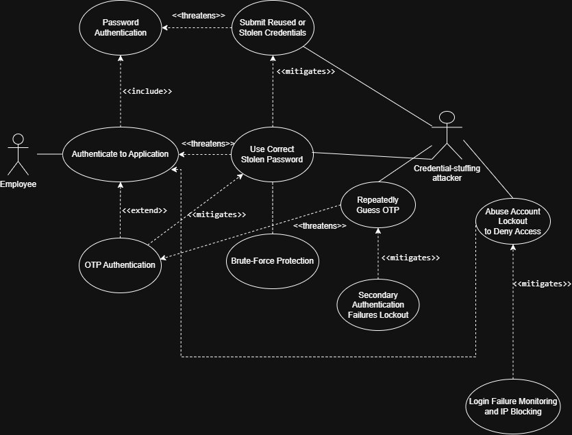

# Requirements for Software Security Engineering — Team 3 (Keycloak)

**Due:** Tue Sep 29, 2026, 11:59 PM · **Points:** 100 (counts for the whole group)
**Submission:** Link to this markdown file in our GitHub repo, submitted on Canvas.
**Tool:** [draw.io / app.diagrams.net](https://app.diagrams.net/) — instructor provided sample shape files on the Canvas assignment page (Use Case Sample.drawio, Use-Misuse Case Sample.drawio).

**Rubric:** Part 1 misuse case notation & quality (50) · Part 1 reflection (10) · Part 2 doc review (20) · Planning & reflection / project board (20)

---

## How this works

Part 1 requires **five essential interactions** between Keycloak and its environment, ideally spread across *different* external interactors (humans or systems). Each team member claims **one** interaction below and owns the full pipeline for it: use case diagram → misuse case analysis → security requirements → alignment check against Keycloak's actual features.

Part 2 does **not** split into five cases — it's a single team review of Keycloak's security-related documentation (see Part 2 section below).

### Claim board

Put your name next to one interaction. These are suggested candidates (biased toward our authorization/credential scope) — confirm or swap at the Friday meeting. Rule of thumb: five *different* interactor types, not five things one actor does.

| # | External interactor | Candidate interaction / feature | Claimed by | Status |
|---|---|---|---|---|
| 1 | End user (human) | Login / authentication via browser (password + OTP) |[@Sewhenu-Ayeni](https://github.com/Sewhenu-Ayeni) | Not started |
| 2 | Realm administrator (human) | Manage user credentials & password policies via Admin Console | [@AyRidd03](https://github.com/AyRidd03) | Not started |
| 3 | Client application (system) | Obtain tokens via OIDC authorization code flow | [@JBoogieman](https://github.com/JBoogieman) | Not started |
| 4 | External identity provider (system) | Identity brokering / federated login (SAML or OIDC IdP) | [@SeanAnderson0](https://github.com/SeanAnderson0) | Not started |
| 5 | Directory service (system) | User federation with LDAP / Active Directory | [@isaiahjames11](https://github.com/isaiahjames11) | Not started |

Other candidates if we swap: Admin REST API automation, service accounts (client credentials grant), user self-service account console, token introspection by a resource server.

---

## Part 1 — Per-person checklist (do this for YOUR claimed interaction)

Copy this checklist under your section below and work through it in order.

- [ ] **1. Define the interaction.** One sentence: who the actor is, and the *critical feature* of Keycloak they use. Tie it back to the enabling systems in our proposal's systems engineering view.
- [ ] **2. Draw the use case diagram** in draw.io. Use cases = features Keycloak supports (not user goals in the abstract). Keep it simple at first — actor, 2–4 use cases, `<<include>>` dependencies where real (e.g., Login includes Password Hashing).
- [ ] **3. Add misuse cases.** Pick a misuser contextualized to our environment — the *name* should convey motive, resources, attack of choice, and access (e.g., "Credential-stuffing botnet operator with breached password lists," not "Hacker"). Start from the threats in our proposal.
- [ ] **4. Iterate.** Go back and forth: misuse case threatens a use case → add a security use case that mitigates it → ask what threatens *that* → repeat until you hit specific functional security requirements Keycloak could implement. **Prioritize mitigations implemented in Keycloak itself, not the environment.** Every misuse case must be addressed by some use case.
- [ ] **5. Use proper notation** (class materials): white ovals = use cases, black/shaded ovals = misuse cases, `<<threatens>>` and `<<mitigates>>` arrows, misusers on the opposite side. Arrange to reduce clutter.
- [ ] **6. Optionally run your diagram description through an AI prompt** to find missed misuse cases (instructor's sample prompt is on the Canvas page). Save the prompt you used — we need one team example plus a reflection on whether it helped.
- [ ] **7. List your derived security requirements** — numbered, specific, functional ("Keycloak shall lock an account after N failed attempts," not "the system should be secure").
- [ ] **8. Alignment check:** for each requirement, does Keycloak actually advertise/implement it? Cite Keycloak docs or code (links). Note gaps.
- [ ] **9. Export your final diagram** (PNG + keep the .drawio source in the repo) and embed it in your section.
- [ ] **10. Log your tasks** on the GitHub Project Board and write your **individual reflection** (what did you learn, what was most useful).

---

### Interaction 1: End-User Authentication (Browser Login + OTP) — @Sewhenu-Ayeni

**Interaction description:**  
An employee uses Keycloak through a web browser to authenticate with a password and one-time password (OTP) before accessing an enterprise application. This interaction is essential because Keycloak provides the authentication service between the employee and the protected enterprise application.

**Use/misuse case diagram:**  

**Misuser profile:**  
**Misuser:** Credential-stuffing attacker using breached credentials

- **Motive:** Gain unauthorized access to an employee's account and enterprise application.
- **Resources:** Lists of previously breached usernames/passwords and automated login tools.
- **Attack of choice:** Credential stuffing through repeated browser login attempts.
- **Available access:** External access to the Keycloak login page, with no legitimate employee account or administrative access.

**Iteration narrative:**  
**Iteration 1 – Credential Stuffing:** A credential-stuffing attacker may use breached username and password combinations to repeatedly attempt authentication through the Keycloak login page. The misuse case **Submit Reused or Stolen Credentials** threatens **Password Authentication**. **Brute-Force Protection** mitigates repeated failed authentication attempts by tracking failures and applying configured lockout protections.

**Iteration 2 – Correct Stolen Password:** If the attacker possesses a correct stolen password, brute-force protection alone may not prevent unauthorized authentication because the password itself is valid. The misuse case **Use Correct Stolen Password** threatens **Authenticate to Application**. **OTP Authentication** mitigates this misuse by requiring an additional authentication factor when OTP is configured as required.

**Iteration 3 – Repeated OTP Guessing:** After obtaining a correct password, an attacker may repeatedly attempt to guess the employee's OTP. The misuse case **Repeatedly Guess OTP** threatens **OTP Authentication**. **Secondary Authentication Failures Lockout** mitigates repeated failures against the second authentication factor according to its configured threshold.

**Iteration 4 – Account Lockout Denial of Service:** An attacker may intentionally cause repeated authentication failures against known employee accounts so that account lockout protections deny legitimate users access. The misuse case **Abuse Account Lockout to Deny Access** threatens **Authenticate to Application**. **Login Failure Monitoring and IP Blocking** mitigates this misuse by using authentication-failure and client-address information to identify attack sources. Keycloak provides the failure information, while blocking an attacking IP may require an external intrusion-prevention or firewall mechanism.

**Derived security requirements:**

| ID | Requirement | Addresses misuse case | Implemented in Keycloak? (doc/code link) |
|---|---|---|---|
| SR-1.1 | Keycloak shall detect repeated failed password authentication attempts and temporarily or permanently disable further login attempts according to the configured brute-force protection settings. | Submit Reused or Stolen Credentials | **Yes.** Keycloak provides configurable brute-force detection, including temporary and permanent lockout. [Keycloak Server Administration Guide](https://www.keycloak.org/docs/latest/server_admin/#password-guess-brute-force-attacks) |
| SR-1.2 | Keycloak shall require a valid OTP as a second authentication factor when OTP is configured as required in the employee authentication flow. | Use Correct Stolen Password | **Yes.** Keycloak supports OTP as a second-factor authenticator in configurable authentication flows. [Keycloak Server Administration Guide](https://www.keycloak.org/docs/latest/server_admin/) |
| SR-1.3 | Keycloak shall track repeated failed OTP authentication attempts and apply a secondary authentication failure lockout according to the configured threshold. | Repeatedly Guess OTP | **Yes.** Keycloak provides Secondary Authentication Failures Lockout for failures against second-factor authenticators such as OTP. [Keycloak Server Administration Guide](https://www.keycloak.org/docs/latest/server_admin/#password-guess-brute-force-attacks) |
| SR-1.4 | Keycloak shall record authentication failures with information sufficient to support monitoring of repeated login failures and identification of the originating client address. | Abuse Account Lockout to Deny Access | **Partially.** Keycloak provides login-failure and client-IP information, but blocking attacking IP addresses relies on an external intrusion-prevention or firewall mechanism. [Keycloak Server Administration Guide](https://www.keycloak.org/docs/latest/server_admin/#password-guess-brute-force-attacks) |

**Alignment observations:**  
The misuse case analysis generally aligns with security capabilities available in Keycloak. Keycloak provides configurable brute-force detection, OTP-based second-factor authentication, and protection against repeated secondary authentication failures. However, some of these protections require administrator configuration and are not enabled by default. The account-lockout denial-of-service scenario also identifies a limitation in Keycloak's protection boundary: Keycloak can provide authentication-failure and client-IP information, but blocking the source of an attack may require an external intrusion-prevention or firewall mechanism.

---

### Interaction 2: <title> — <name>

**Interaction description:**
*(1–2 sentences: actor, feature, why it's essential)*

**Use/misuse case diagram:**
``

**Misuser profile:** *(name, motive, resources, attack of choice, access)* 

**Iteration narrative:** *(brief: misuse case → countermeasure → next misuse case → …)*

**Derived security requirements:**

| ID | Requirement | Addresses misuse case | Implemented in Keycloak? (doc/code link) |
|---|---|---|---|
| SR-1.1 | | | |
| SR-1.2 | | | |

**Alignment observations:** *(sufficiency of Keycloak's features vs. what the analysis expects)*

### Interaction 3: <title> — <name>
*(same structure)*

### Interaction 4: Identity Brokering - External Identity Provider — @SeanAnderson0

**Interaction description:**
A partner organization's SAML 2.0 identity provider (IdP) authenticates contractors and sends Keycloak a signed assertion, which Keycloak's Identity Brokering feature validates, links to a local account, and maps onto the realm roles that govern access to the HR and payroll, IT service desk, and finance applications. This interaction is essential because it is the only login path where identity is established outside our organization, so every role a contractor receives depends on how far Keycloak trusts an assertion it did not create.

**Use/misuse case diagram:**
``

**Misuser profile:**

-**Name:** Attacker who has compromised the partner IdP's administrator account, seeking finance and payroll access.
-**Motive:** Gain access to finance and HR/payroll systems through a login Keycloak already trusts.
-**Resources:** The partner IdP's administrator account, which lets them create users, change any user attribute, and start IdP-initiated logins.
-**Attack of Choice:** Sending signed or smuggled assertions that Keycloak may accept, such as ones carrying a victim employee's email or privileged group values.
-**Access:** Keycloak's public broker endpoint through the partner IdP, but no Keycloak administrator account or corporate network access.

**Iteration narrative:**

**Iteration 1 – Smuggled Assertion:** Rather than having the partner IdP issue and log a separate login for each user they want to impersonate, the attacker may take one response the IdP genuinely signed and attach an unsigned assertion naming a different user, hoping Keycloak reads the unsigned one. The misuse case Smuggle an Unsigned Assertion Past Signature Checks threatens Validate IdP Response Signature and Conditions. Validate Signatures and Bind Them to the Processed Assertion mitigates this by rejecting any assertion the IdP's signature does not cover.

**Iteration 2 – Account Link Hijacking:** With signatures enforced, the attacker could instead set a partner account's email to match a payroll employee's, so the IdP signs a genuine assertion with that email. The misuse case Assert a Victim Employee's Email to Hijack Account Linking threatens Link Brokered Identity to a Local Account. Require Proof of Account Ownership Before Linking mitigates this by making the existing account's owner verify by email or sign in before the accounts are linked.

**Iteration 3 – Privileged Group Claims:** Unable to take over an employee account, the attacker may add privileged group values to their own partner account so Keycloak's mappers grant them finance roles. The misuse case Assert Privileged Role and Group Claims from the Partner IdP threatens Map Claims and Assertions to Roles and Groups. Restrict Which Roles IdP Mappers Can Grant mitigates this by keeping privileged roles out of partner mappers and only letting administrators create mappers for roles they are allowed to grant themselves.

**Iteration 4 – IdP-Initiated Bypass:** If administrators restrict the partner provider to account linking only or disable an old client, the attacker could start logins from the IdP side to get around those settings. The misuse case Use the IdP-Initiated Endpoint to Bypass Broker Checks threatens Establish SSO Session and Issue Tokens. Enforce Broker Checks on Every Entry Point mitigates this by applying the same checks to IdP-initiated logins.

**Iteration 5 – Session After Offboarding:** When the partner firm discovers the breach and disables the attacker's accounts, Keycloak is not automatically notified, so the attacker's existing session may keep working. The misuse case Keep Using a Keycloak Session After the IdP Account Is Disabled threatens Terminate Brokered Session on Upstream Revocation. Limit and Revoke Federated Sessions Locally mitigates this by expiring sessions on Keycloak's own timeouts and letting administrators revoke them without the IdP.

**Derived security requirements:**

| ID | Requirement | Addresses misuse case | Implemented in Keycloak? (doc/code link) |
|---|---|---|---|
| SR-4.1 | Keycloak shall reject any SAML response or assertion from a brokered identity provider that is not signed by that provider's configured certificate. | Smuggle an Unsigned Assertion Past Signature Checks | Partially. Keycloak validates the signature on the assertion it actually processes, but only when Validate Signature is turned on for that provider. If it is off, Keycloak does not verify signatures, so forged assertions can be accepted. [Server Administration Guide](https://www.keycloak.org/docs/latest/server_admin/index.html#_identity_broker), [SAMLEndpoint.java](https://github.com/keycloak/keycloak/blob/6688a3d63f59e0c4a9131bfdd556c4312799f04e/services/src/main/java/org/keycloak/broker/saml/SAMLEndpoint.java#L604-L614) |
| SR-4.2 | Keycloak shall require the owner of an existing account to verify by email or by signing in before linking it to a brokered identity with a matching email.| Assert a Victim Employee's Email to Hijack Account Linking | Yes. The default first broker login flow requires email verification or re-authentication before linking accounts, although an administrator can replace it with an auto-link flow. [Server Administration Guide](https://www.keycloak.org/docs/latest/server_admin/index.html#_identity_broker_first_login), [DefaultAuthenticationFlows.java](https://github.com/keycloak/keycloak/blob/6688a3d63f59e0c4a9131bfdd556c4312799f04e/server-spi-private/src/main/java/org/keycloak/models/utils/DefaultAuthenticationFlows.java#L533-L700) |
| SR-4.3 | Keycloak shall only let an administrator create an identity provider mapper for a role that the administrator is allowed to grant. | Assert Privileged Role and Group Claims from the Partner IdP | No. Creating or editing a mapper only requires permission to manage identity providers, so an administrator with that permission can create a mapper that grants any role, including admin roles. [IdentityProviderResource.java](https://github.com/keycloak/keycloak/blob/6688a3d63f59e0c4a9131bfdd556c4312799f04e/services/src/main/java/org/keycloak/services/resources/admin/IdentityProviderResource.java#L327-L352), [Keycloak issue #50444](https://github.com/keycloak/keycloak/issues/50444)|
| SR-4.4 | Keycloak shall apply the Account Linking Only setting and disabled-client checks to every brokered login, including logins started by the identity provider. | Use the IdP-Initiated Endpoint to Bypass Broker Checks | Yes. Current releases check both settings on every brokered login, including IdP-initiated ones. [Server Administration Guide](https://www.keycloak.org/docs/latest/server_admin/index.html#_general-idp-config), [IdentityBrokerService.java](https://github.com/keycloak/keycloak/blob/6688a3d63f59e0c4a9131bfdd556c4312799f04e/services/src/main/java/org/keycloak/services/resources/IdentityBrokerService.java#L723-L770) |
| SR-4.5 | Keycloak shall end brokered sessions using its own timeouts and allow an administrator to revoke them without relying on the identity provider. | Keep Using a Keycloak Session After the IdP Account Is Disabled| Partially. Session timeouts and admin sign-out apply to brokered sessions, but offline tokens are not limited by session timeouts and are not revoked when an admin signs the user out. [Server Administration Guide](https://www.keycloak.org/docs/latest/server_admin/index.html#_offline-access), [UserResource.java](https://github.com/keycloak/keycloak/blob/6688a3d63f59e0c4a9131bfdd556c4312799f04e/services/src/main/java/org/keycloak/services/resources/admin/UserResource.java#L688-L708)|

**Alignment observations:**
Keycloak's features are mostly sufficient for what this analysis expects, but not fully. Of the five requirements, two are fully met, account-link verification and consistent checks on IdP-initiated logins, two are only partially met, and one is not met. The partial ones depend on configuration or have exceptions: signature validation runs only when an administrator enables it for each identity provider, and offline tokens are not ended by Keycloak's session timeouts or by signing a user out. The requirement Keycloak does not meet is limiting which roles an identity provider mapper can grant, so a mapper created by a lower-privileged administrator could give brokered users admin access. Keycloak also cannot tell when the partner IdP has been compromised or has disabled an account, so it relies on its own session limits and on administrators to cut off access.

### Interaction 5: <title> — <name>
*(same structure)*

---

## Part 1 — Team-level items (shared, assign at meeting)

| Task | Owner | Status |
|---|---|---|
| Confirm the 5 interactions cover different interactor types (no overlap) | Team — Friday mtg | |
| AI prompt example + reflection on its usefulness for improving diagrams | | |
| Summary of alignment findings across all 5 cases (sufficiency of Keycloak's security features vs. misuse case expectations) | | |
| Compile individual reflections into one team reflection | | |
| GitHub Project Board up to date + link in report: `<link here>` | | |
| Final assembly/formatting of this file + Canvas submission | | |

## Team Reflection (Part 1)

*(Compiled from individual reflections — each member answers: What did you learn? What did you find most useful?)*

---

## Part 2 — OSS documentation review (20 pts, team-level)

This part is **not** split into five cases. It's one deliverable: review Keycloak's **security-related configuration and installation documentation** and summarize what's missing or could be improved. The instructor's angle: docs contributions are an easy on-ramp to the open-source community.

Suggested split if we want everyone touching it — each person reviews one doc area for their claimed interaction's feature (e.g., #1 reviews authentication/OTP config docs, #3 reviews client/OIDC setup docs, #5 reviews LDAP federation docs), then one person merges observations.

**What to produce:**

| Doc area reviewed | Reviewer | Observations (missing / unclear / could improve) |
|---|---|---|
| Server installation & hardening guide | | |
| Authentication / credential configuration |[@Sewhenu-Ayeni](https://github.com/Sewhenu-Ayeni) | |
| Client & token configuration | | |
| Federation / brokering configuration | | |
| Other: | | |

**Summary of observations:** *(what could be improved or is missing, overall)*

*(Optional stretch: note whether any finding is worth an actual docs issue/PR to the Keycloak project.)*

---

## Submission checklist (before Sep 29)

- [ ] All 5 interaction sections complete with embedded diagrams
- [ ] Every misuse case is mitigated by a use case in its diagram
- [ ] AI prompt + reflection included
- [ ] Team reflection compiled
- [ ] Part 2 summary complete
- [ ] Project board link works and shows task assignments
- [ ] Canvas submission: link to this file in the repo
