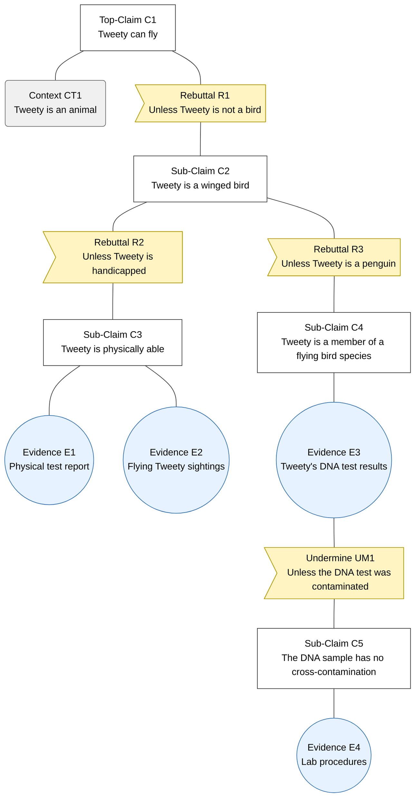

# Diagram guide — Assurance Cases

Start every diagram from the instructor's `Assurance Case.drawio` (Canvas assignment page) so notation stays consistent.

**File naming:** `assurance-case-claim-N.drawio` (source) + `assurance-case-claim-N.png` (export embedded in the report). Commit your own files so your contribution shows in history.

## Notation

| Element | Shape | Wording rule | Needed? |
|---|---|---|---|
| **Claim** (top / sub) | Rectangle | Outcome predicate: *entity + critical property + value/uncertainty*. Not a mechanism. | Required |
| **Rebuttal** | Note shape | "Unless …" — short | Required |
| **Evidence** | Circle | **Noun phrase only**, tangible and measurable. No verbs. | Required, every branch ends here |
| **Context** | Rounded rectangle | Scopes a term in the claim | As needed |
| **Undermine** | Note shape on evidence | "Unless …" doubt about the evidence | As needed |
| **Inference rule / Undercut** | Blue process shape / note | "If … then …" / "Unless …" | Optional (instructor: advanced) |

**IDs:** prefix with your claim number so the five diagrams never collide: `C1`, `C1.1`, `R1.1`, `CT1.1`, `E1.1`, `UM1.1`.

## Wording

| | Example | Why |
|---|---|---|
| ❌ Claim | "The system uses AES encryption." | Technology (means), not an assured outcome |
| ✅ Claim | "The system minimizes information disclosure during communication." | Outcome + property |
| ❌ Evidence | "Tests show passwords are hashed" | Verb phrase, which makes it a claim |
| ✅ Evidence | "Physical test report", "Lab procedures" | Noun phrase, tangible |

## Argument shape (instructor's sample, simplified)

Claim → "Unless" rebuttal → sub-claim that eliminates the doubt → … → evidence.

